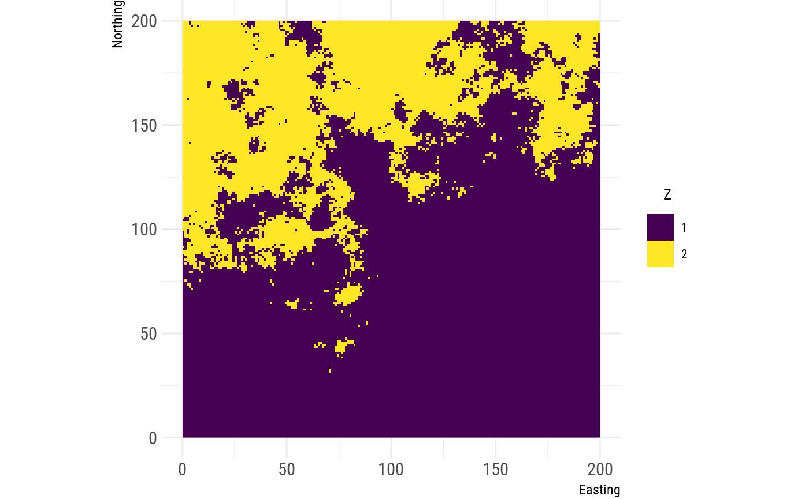
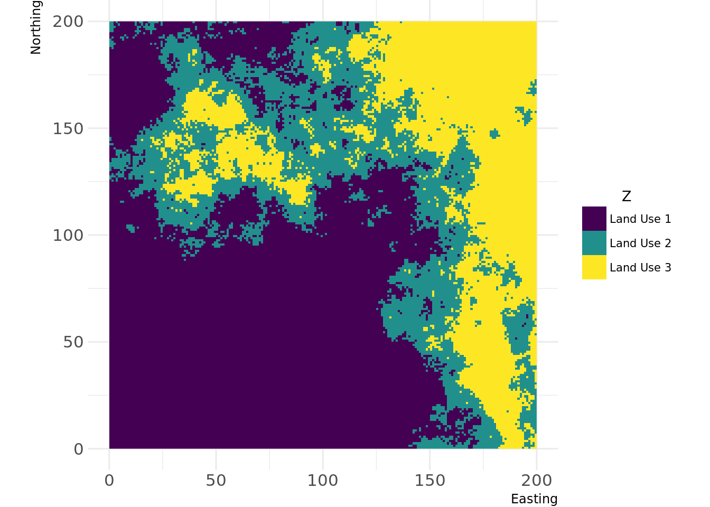
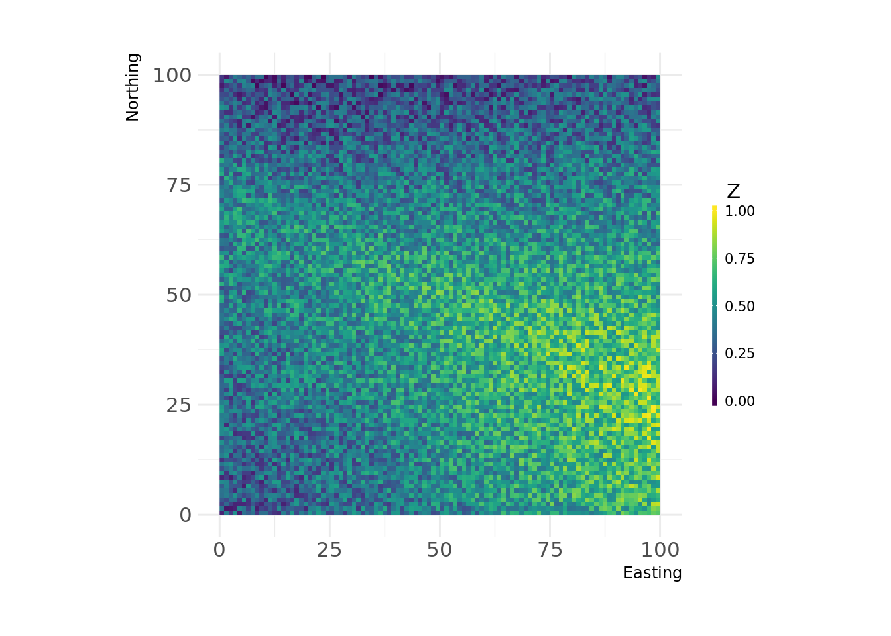
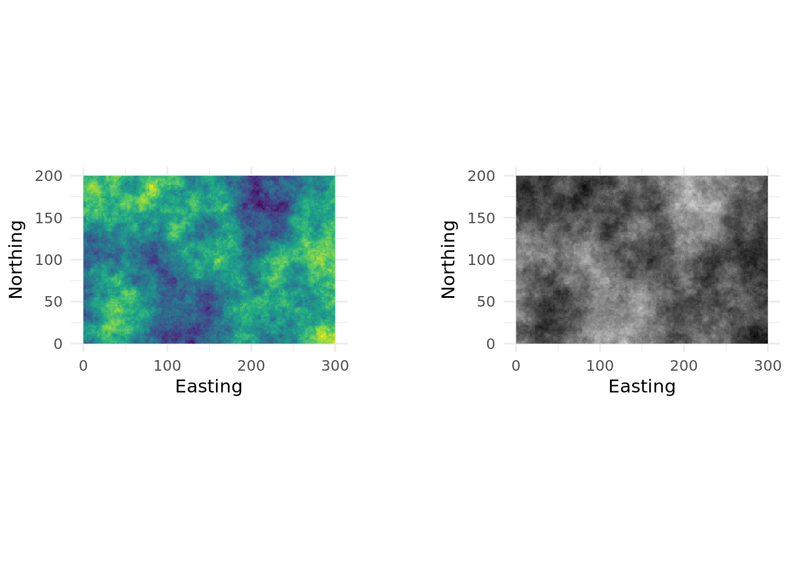

[](https://travis-ci.org/marcosci/landscapetools) [](https://ci.appveyor.com/project/marcosci/landscapetools) [](https://codecov.io/github/marcosci/landscapetools?branch=master)

<!-- README.md is generated from README.Rmd. Please edit that file -->
landscapetools
==============

`landscapetools` provides utility functions to work with landscape data (raster\* Objects).

### The following functions are implemented:

#### Themes:

`theme_nlm`, `theme_nlm_grey`: Opinionated ggplot2 theme to visualize raster (continous data).<br/> `theme_nlm_discrete`,`theme_nlm_grey_discrete`: Opinionated ggplot2 theme to visualize raster (discrete data).<br/> `util_import_roboto_condensed`: Import Roboto Condensed font for `theme_nlm`.<br/>

#### Utilities:

`util_binarize`: Binarize continuous raster values, if &gt; 1 breaks are given return a RasterBrick.<br/> `util_classify`: Classify a raster into proportions based upon a vector of class weightings.<br/> `util_merge`: Merge a primary raster with other rasters weighted by scaling factors.<br/> `util_raster2tibble`, `util_tibble2raster`: Coerce raster\* objects to tibbles and vice versa.<br/> `util_rescale`: Linearly rescale element values in a raster to a range between 0 and 1.<br/>

#### Visualization

`util_plot`: Plot a Raster\* object with the landscapetools default theme (as ggplot).<br/> `util_facetplot`: Plot multiple raster (RasterStack, -brick or list of raster) side by side as facets.<br/>

Installation
------------

You can install the development version from [GitHub](https://github.com/) with:

``` r
# install.packages("devtools")
devtools::install_github("marcosci/landscapetools")
```

Usage
-----

``` r
library(patchwork)
library(nlmr)
library(landscapetools)
library(ggplot2)
# Create artificial landscape
nlm_raster <- nlm_mpd(ncol = 200, nrow = 200, roughness = 0.8)
#> nlm_mpd returns RasterLayer that fits in the dimension 2^n+1
```

### Utilities

### Binarize

``` r
binary_stack <- util_binarize(nlm_raster, breaks = c(0.3, 0.5, 0.7, 0.9))
util_facetplot(binary_stack)
```



### Classify

``` r
classified_raster <- util_classify(nlm_raster,
                                   c(0.5, 0.25, 0.25),
                                   level_names = c("Land Use 1", "Land Use 2", "Land Use 3"))
util_plot(classified_raster, discrete = TRUE)
```



### Merge

``` r
pL <- nlm_edgegradient(ncol = 100,
                       nrow = 100)

sL1 <- nlm_distancegradient(ncol = 100,
                            nrow = 100,
                            origin = c(10, 10, 10, 10))
sL2 <- nlm_random(ncol = 100,
                  nrow = 100)
mL1 <- util_merge(pL,
                  c(sL1, sL2),
                  scalingfactor = 1)
  
util_plot(mL1)
```



### Visualize

``` r
g1 <- util_plot(nlm_raster) + guides(fill = FALSE)
g2 <- util_plot_grey(nlm_raster) + guides(fill = FALSE)
g1 + g2
```



Meta
----

-   Please [report any issues or bugs](https://github.com/marcosci/landscapetools/issues/new/).
-   License: GPL3
-   Get citation information for `landscapetools` in R doing `citation(package = 'landscapetools')`
-   We are very open to contributions - if you are interested check [Contributor Code of Conduct](CONTRIBUTING.md).
    -   Please note that this project is released with a [Contributor Code of Conduct](CONDUCT.md). By participating in this project you agree to abide by its terms.
